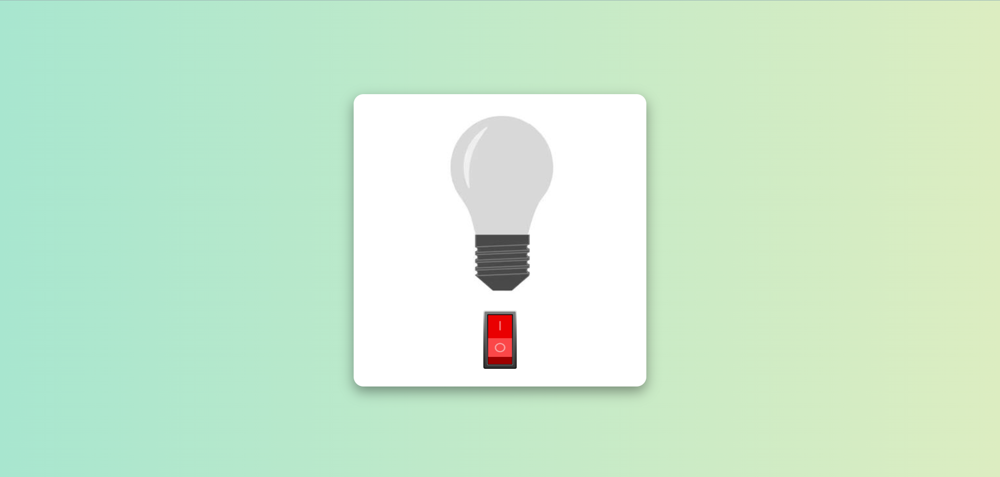
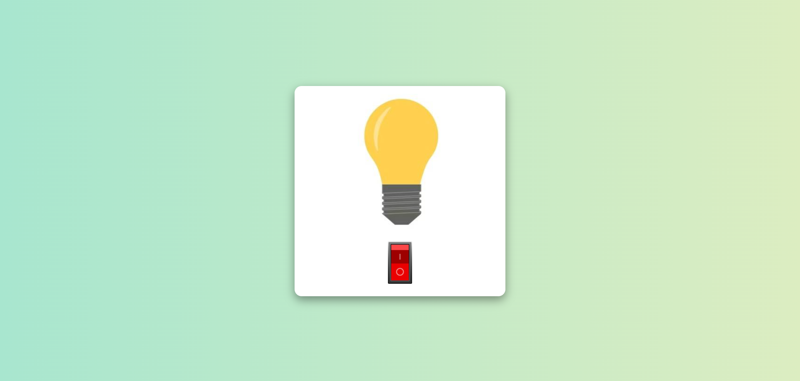

# Bulb On/Off Toggle
This is a simple web project created to understand how to manipulate the DOM (Document Object Model) using JavaScript. The project features a light bulb image that can be toggled between "on" and "off" states by clicking a button, mimicking a real-world light bulb's functionality.

## Screenshots
## Light Off

## Light On


## Features
- **DOM Manipulation**: Demonstrates basic DOM manipulation where images change based on user interaction.
- **Responsive Design**: The project is responsive and adapts to various screen sizes.
- **Simple UI**: Clean, minimalistic design with a gradient background and a button to toggle the light bulb image on or off.

## Tech Stack
- **HTML**: For the structure of the page.
- **CSS**: Used for styling, including Flexbox and media queries for responsiveness.
- **JavaScript**: Used for DOM manipulation to toggle the light bulb image and the button state.

## How to Use
1. **Clone the repository**:
   ```bash
   git clone https://github.com/Aastha-Bhatia/Bulb.git
   
## Notes
This is a simple project designed to understand DOM manipulation and basic interactivity in JavaScript.
The project is fully functional, but responsiveness for screen rotation needs further fine-tuning (which will be addressed later).
The project focuses on fundamental concepts, and it’s a great starting point for learning JavaScript interactions.

## Future Improvements
- **Screen Rotation Handling: Fine-tune responsiveness to better support screen rotations.
- **Animations & Transitions: Add smooth transitions or animations when toggling the bulb.
- **Additional Features: Explore additional features like changing the bulb's color, adding sound effects, or making the button change styles dynamically.
